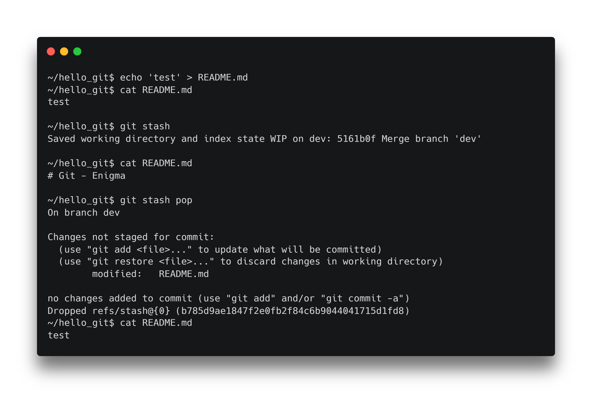
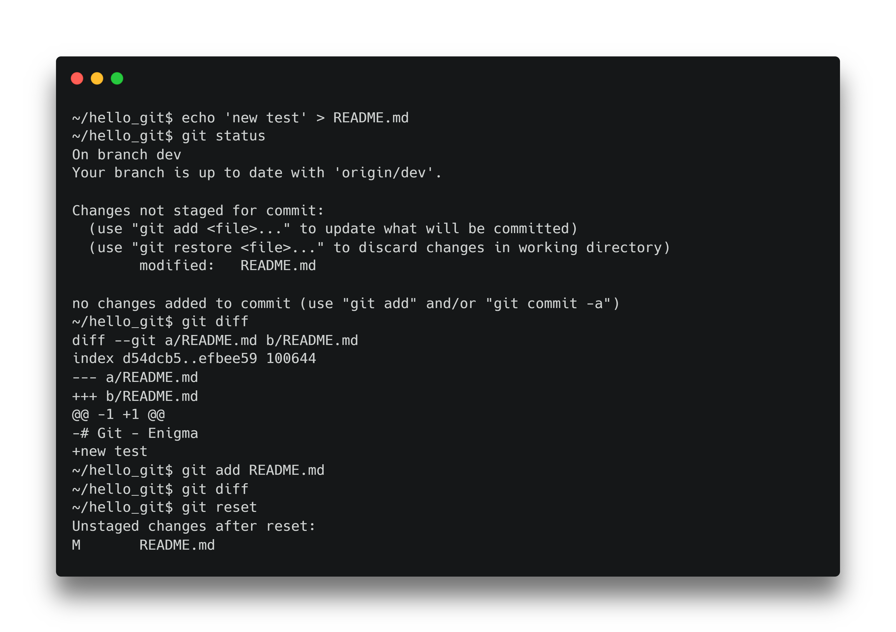
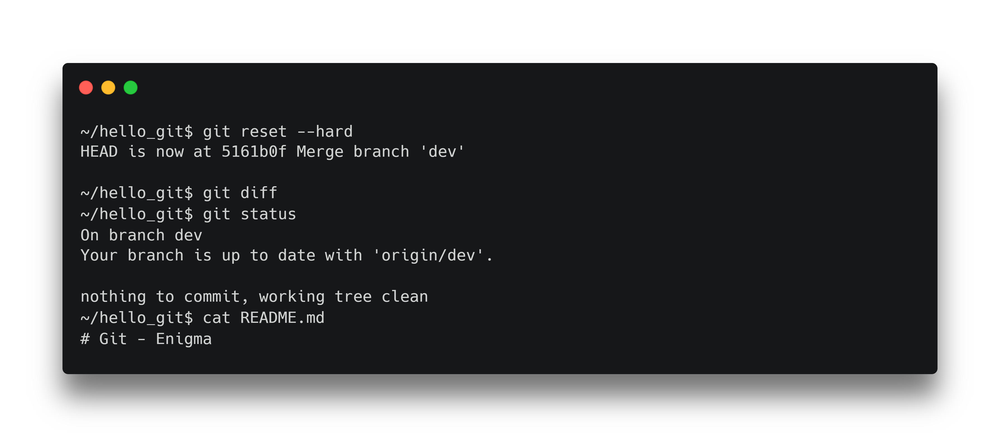
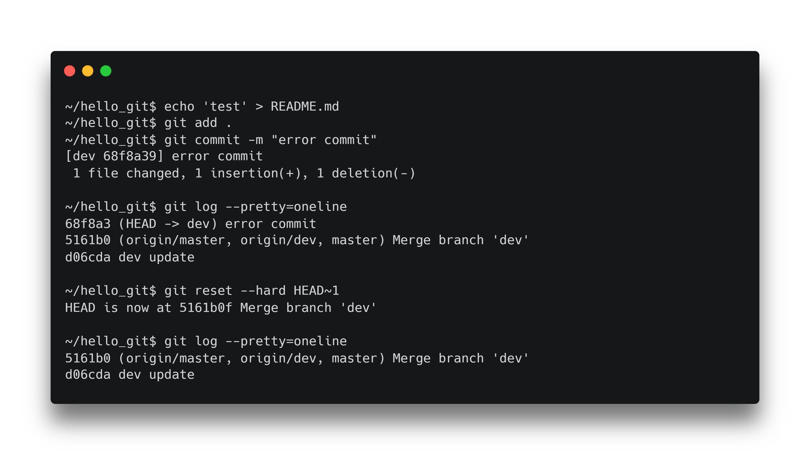

# Git

Quelques commandes utiles.

---

# Stash

> Sauvegarder du travail entre branches

<!--
La commande git stash nous permet de sauvegarder de travail quand nous devons changer de branche.
-->

---



<!--
Nous pouvons voir qu'un stash sauvegarde les modifications avant de les annuler dans les espaces de travail.

Cela permet de changer de branches sans perdre nos modifications.
-->

<!--
```
echo 'test' > README.md
cat README.md

git stash
cat README.md

git stash pop
cat README.md
```
-->

---

# Reset

> Remise à zéro des espaces

<!--
La commande reset nous permets de faire du propre dans nos espaces de travail
-->

---



<!--
Git reset nous permets par exemple de faire un reset de notre index
-->

<!--
```
echo 'test' > test.txt
echo 'test' > new.txt
git add .
git status
git reset
git status
```
-->

---



<!--
L'option --hard nous permet de faire un reset de notre espace de travail.
Autrement dit d'annuler la modification de notre fichier README.md
-->

<!--
```
git reset --hard
git diff
git status
```
-->

---



<!--
Nous pouvons nous servir de la commande reset pour annuler un commit en indiquant que nous voulons aller sur HEAD -1
-->

<!--
```
echo 'test' > README.md
git add .
git commit -m "error commit"

git log --pretty=oneline
git reset --hard HEAD~1
git log --pretty=oneline
```
-->