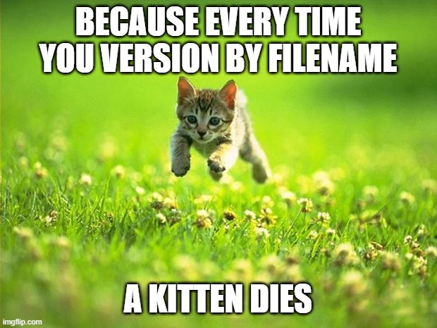
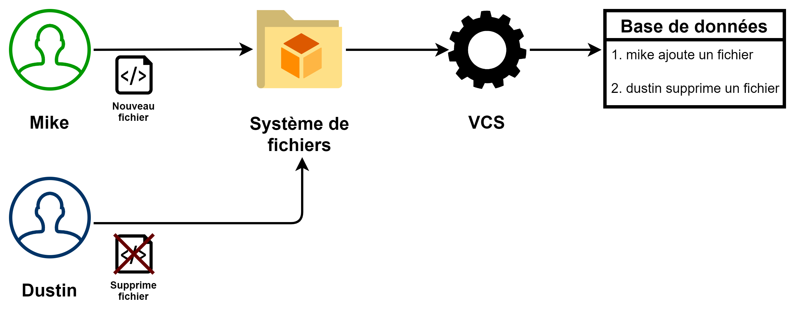
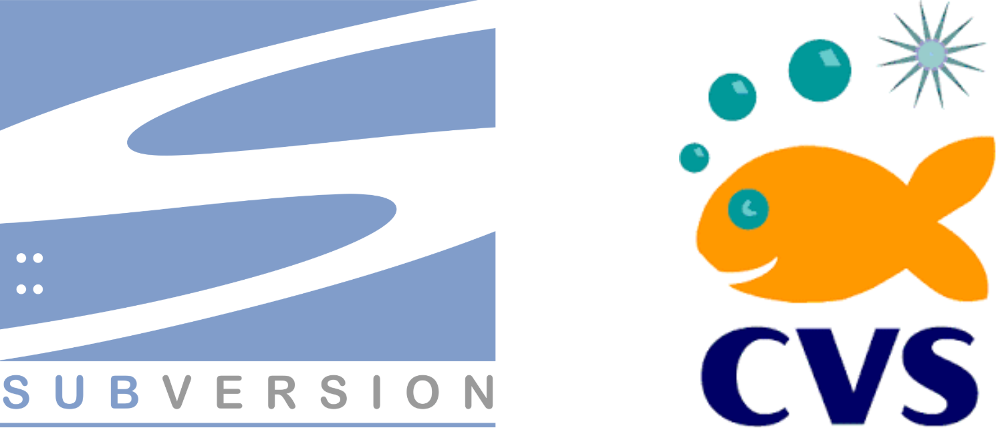

# Outils Collaboratifs

Comment travailler efficacement en équipe ?

<!--
Comment travailler sur du texte en équipe ?
-->

---

# Versions de fichier

> Pourquoi versionner son code source ?

---

> Essentiellement pour remonter dans le temps

<!--
Créer des versions nous permet de revenir à un état de la vie d'un projet, retrouver ce que nous avons fait, ce que nous avons modifié ou supprimé.
-->

---

# Contrôle de version (VCS)

Pourquoi utiliser un outil de contrôle de version ?

<!--
Un outil de contrôle de version est un logiciel qui suit et gère les changements apportés à un système de fichier, autrement dit dans un dossier.
-->

---

<!--
Pour travailler à plusieurs, gérer des versions de fichiers pour chaque utilisateur devient vite compliqué.

Le principe de base est d'enregistrer en base de données chacune des actions de l'utilisateur dans le système de fichier.
-->

---

<!--
Les deux outils de contrôle de versions les plus connus sont Apache Subversion et CVS.
-->

---

## Pourquoi travailler sur un système distribué ?

> Essentiellement pour ne pas être bloqué lors d'une panne du service distant

<!--
Le problème dans un système centralisé, c'est que l'ensemble des fichiers et des versions sont contenus dans le serveur.

Lors d'une panne, nous pouvons donc perdre nos fichiers.

Au mieux un développeur aura la dernière version sur son poste et pourra la mettre en ligne.

Au pire, personne n'a plus de copie du code sur son poste.

C'est pour ça que sont apparus les contrôles de versions distribués.

Dans un système distribué, tout le monde possède l'intégralité du code et des versions.

Sous réserve de synchronisation !
-->

---

---

## Concepts de base

Dépôts et fonctions d'un DVCS. 

---

### Dépôts

<!--
Le dépôt est l'endroit où sont stockées les informations du DVCS, il contient en autre les différentes versions de nos fichiers.
-->

---

<!--
Le clone permet de copier un dépôt distant sur son poste.
-->

---

<!--
Pull permet de télécharger les modifications du dépôt distant dans le dépôt local.
-->

---

<!--
Push permet de téléverser les modifications du dépôt local dans le dépôt distant.
-->

---

# Git - Présentation

La référence des contrôles de version.

<!--
Git est un outil de contrôle de versions distribué créé en 2005 par le papa de Linux.

En 16 ans, il est devenu la référence des contrôleurs de versions dans le monde du développement.
-->
---

## Fonctionnement

Comment fonctionne Git ?
Quels sont les concepts importants ?

<!--
Git est un outil qui contrôle un système de fichiers qui repose lui-même sur un système de fichiers pour sauvegarder ses informations.

On pourrait le voir comme une version allégée du système de fichiers Unix. Étonnant de la part du père de Linux ?
-->