# Git

Comment organiser notre travail ?

<!--
Comment facilement travailler à plusieurs sur le même projet ?

A l'aide de conventions.

Il existe 4 grandes conventions :
- Git flow
- GitHub flow
- Gitlab flow
- One flow
-->

---

# Git Flow

<!--
La statégie Git Flow a été créée en 2010 par Vincent Drisseen.
-->

---

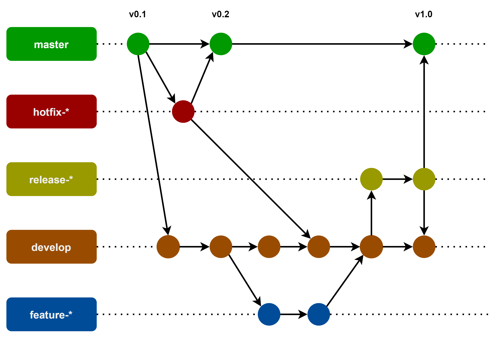

<!--
La stratégie Git Flow repose sur 2 branches à la durée de vie infine. master et develop

- master : Branche qui contient le code déployé en production
- develop : Branche qui contient le code déployé en pré-production
- hotfix-* : Branche qui contient le code d'un correctif urgent
- feature-* : Branche qui contient le code d'une nouvelle fonctionnalité
- release-* : Branche qui contient le code d'une nouvelle version de l'application

Voyons comment faire en ligne de commande
-->

---

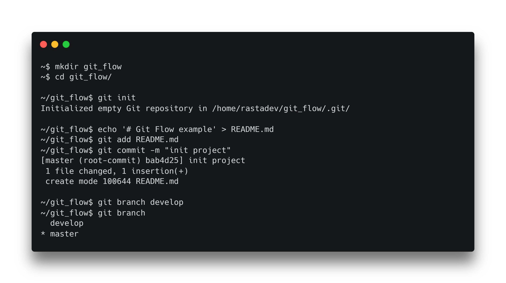

<!--
Création d'un nouveau projet Git
-->

<!--
```
mkdir git_flow
cd git_flow/

git init
echo '# Git Flow example' > README.md
git add README.mdgit commit -m "init project"

git branch develop
git branch
```
-->

---

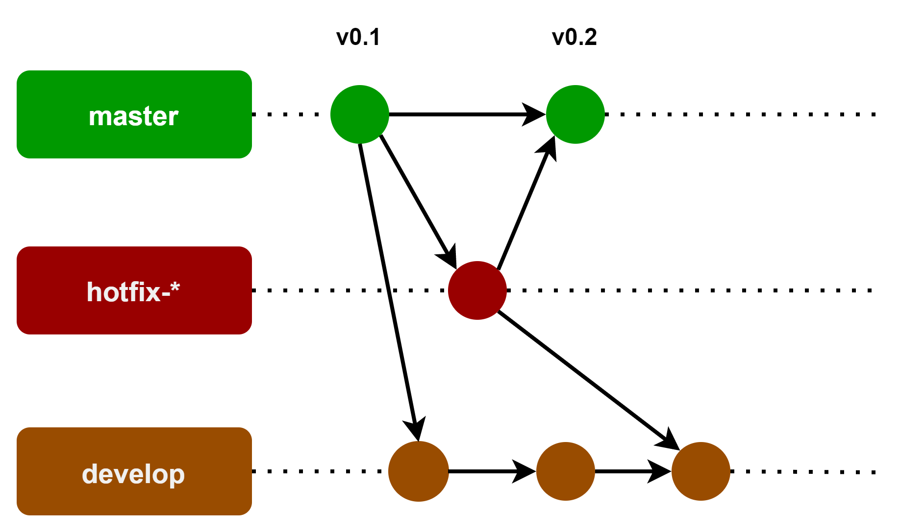

<!--
Commencons par la branche hotfix.

Les regles sont : 
- La branche hotfix part de la branche master
- La branche hotfix est merge sur la branche master et la branche develop
- Une fois merge, la branche peux être supprimée
-->

---

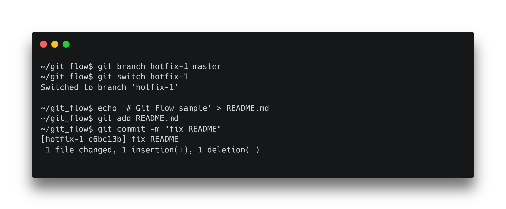

<!--
Préparons notre commit sur la branche hotfix
-->

<!--
```
git branch hotfix-1 master
git switch hotfix-1

echo '# Git Flow sample' > README.md
git add README.md
git commit -m "fix README"
```
-->

---

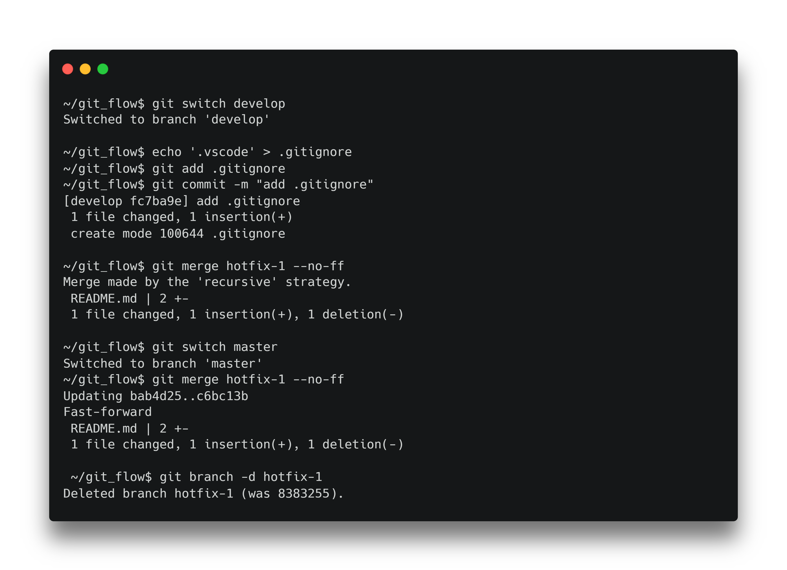

<!--
Faisons un merge de hotfix-1 dans master et develop

On utilise l'option --no-ff pour forcer un merge avec un commit de merge
-->

<!--
```
git switch develop
echo '.vscode' > .gitignore
git add .gitignore
git commit -m "add .gitignore"

git merge hotfix-1 --no-ff

git switch master
git merge hotfix-1 --no-ff
 
git branch -d hotfix-1
```
-->

---


<!--
Les règles sont :
- Une branche feature part de develop
- Un branche feature est merge dans la branche develop
- Une fois merge, la branche peux être supprimée
-->

---

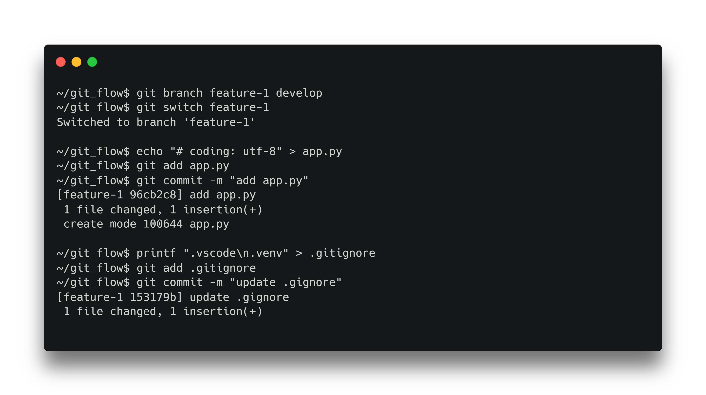

<!--
Préparons 2 commit
-->

<!--
```
git branch feature-1 develop
git switch feature-1

echo '# coding: utf-8' > app.py
git add app.py
git commit -m "add app.py"

printf ".vscode\n.venv" > .gitignore
git add .gitignore
git commit -m "update .gitignore"
```
-->

---

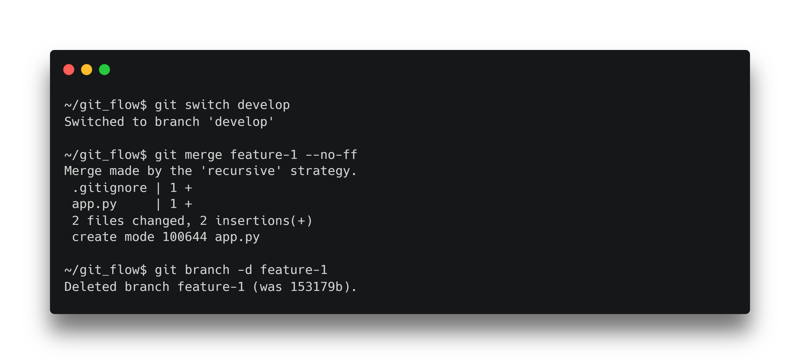

<!--
Puis réalisons le merge sur develop
-->

<!--
```
git switch develop
git merge feature-1 --no-ff
git branch -d feature-1
```
-->

---

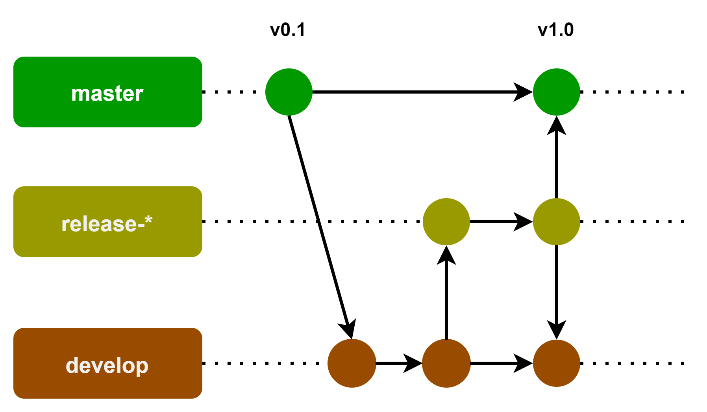

<!--
Les règles sont :
- Une branche release part de develop
- Une branche release est merge dans master et develop
- Une fois merge la branche peux être supprimée
-->

---

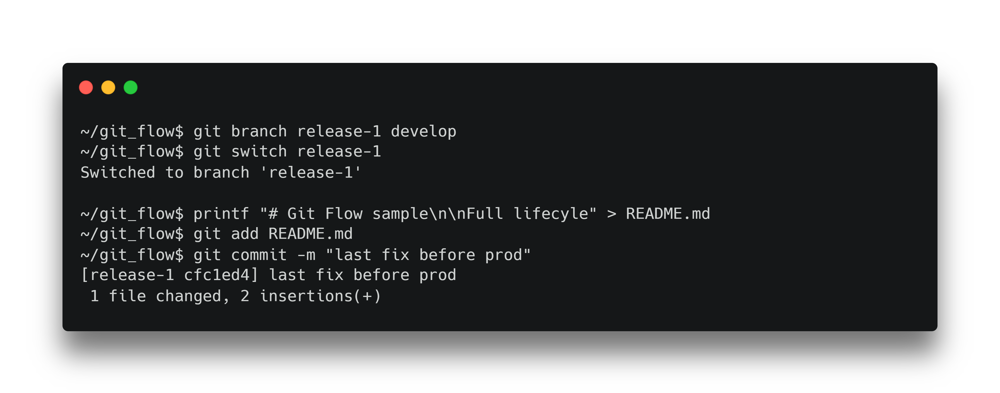

<!--
Préparons un commit
-->

<!--
```
git branch release-1 develop
git switch release-1

printf "# Git Flow sample\n\nFull lifecyle" > README.md
git add README.md
git commit -m "last fix before prod"
```
-->

---

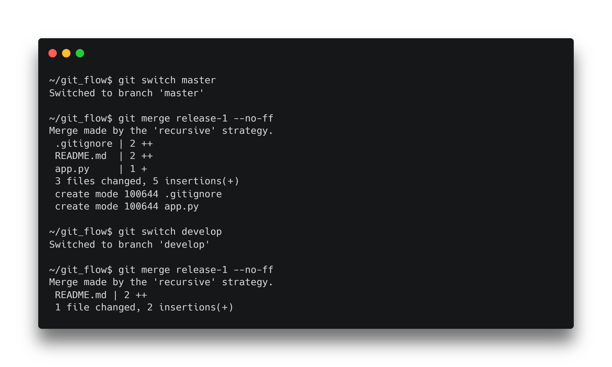


<!--
Puis réalisons le merge sur master et develop
-->

<!--
git switch master
git merge release-1 --no-ff

git switch develop
git merge release-1 --no-ff
-->

---

# GitHub Flow

<!--
La statégie GitHub Flow a été créée en 2011 par GitHub.

C'est une alternative plus simple à la stratégie Git Flow.

C'est une stratégie utile pour les petits projets
-->

---

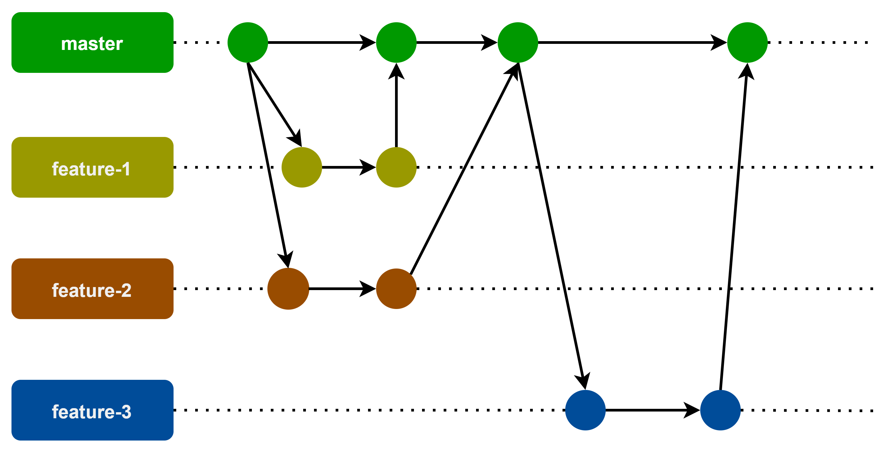

<!--
Les règles sont :
- Une branche feature part de master
- Une branche feature est merge dans master
- Une fois merge, une branche peux être supprimée
-->

---

# Gitlab Flow

<!--
La statégie Gitlab Flow a été créée en 2014 par Gitlab.
-->

---

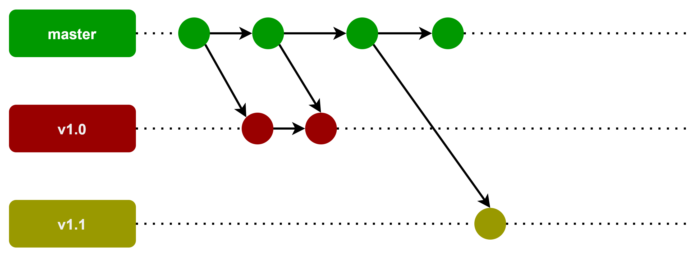

<!--
Le principe est d'utiliser la branche master pour développer et d'utiliser des branches pour stocker les versions de l'application.

Comme le developpement des hotfix est réalisé sur la branche master, il est nécessaire de mettre à jours les branches concernées à l'aide de la commande cherry pick
-->

---

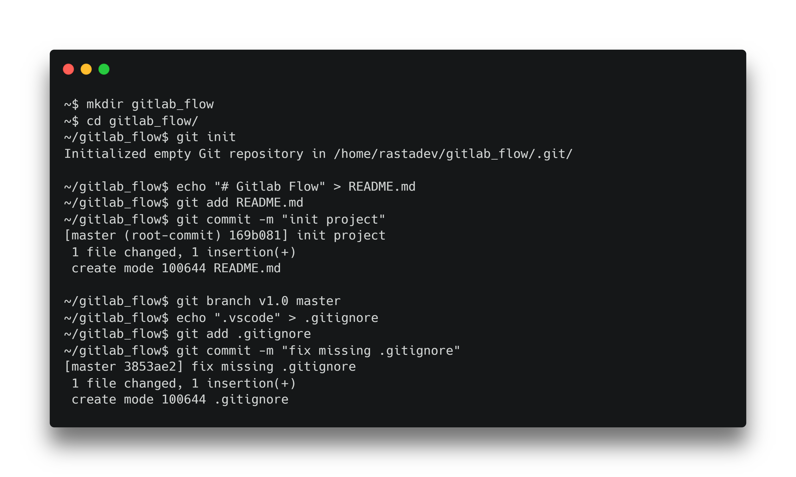

<!--
Création d'un nouveau projet Git
-->

<!--
```
mkdir gitlab_flow
cd gitlab_flow/
git init

echo "# Gitlab Flow" > README.md
git add README.md
git commit -m "init project"
 
git branch v1.0 master
echo ".vscode" > .gitignore
git add .gitignore
git commit -m "fix missing .gitignore"
```
-->

---

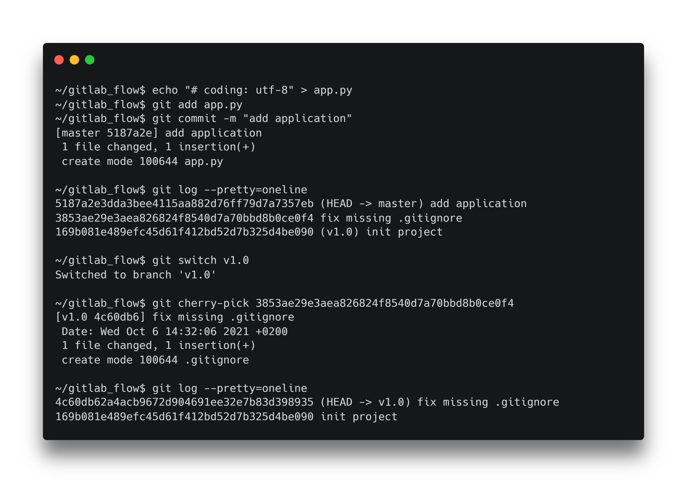

<!--
Faisons maintenant un cherry pick de notre fix sur notre branche v1.0 (c'est à dire récupérer le commit de fix dans notre historique Git).
-->

<!--
```
echo "# coding: utf-8" > app.py
git add app.py
git commit -m "add application"
 
git log --pretty=oneline
git switch v1.0

git cherry-pick <id>
git log --pretty=oneline
```
-->

---

# One Flow

<!--
La statégie Gitlab Flow a été proposée en 2015 par Adam Ruka.

Elle reprends les règles de la statégie Git Flow, à ceci près que la stratégie One Flow ne possède pas de branche develop.
-->

---

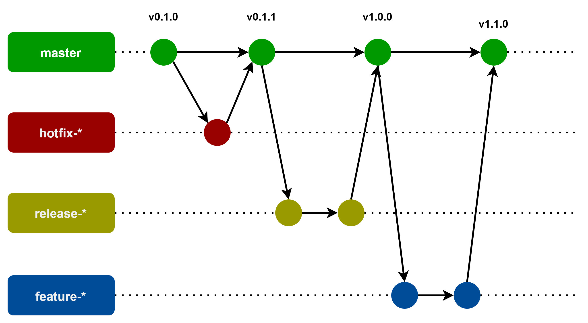

---

# Exercice 1

- Réaliser l'ensemble des stratégies dans des projets différents
- Pousser le résultat final et l'ensemble des branches sur GitHub

---

# Exercice 2

- En groupe de 3 ou 4 personnes
- Choisir une stratégie de branches pour une API fictive
- Expliquer les raisons du choix dans un fichier README
- Pousser le résultat sur GitHub