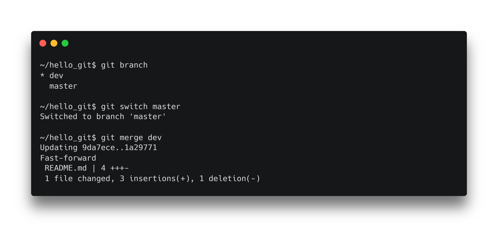
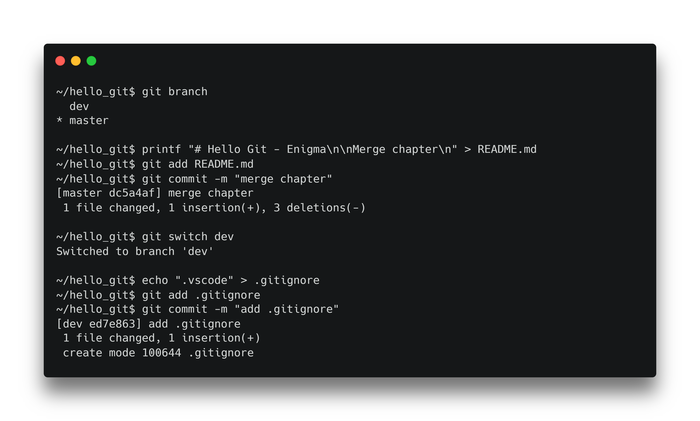
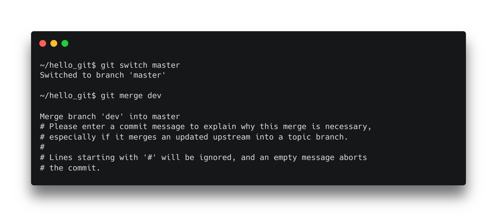
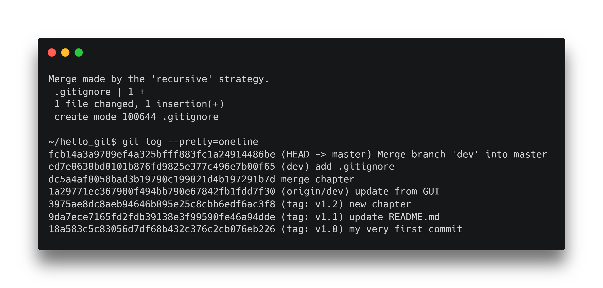
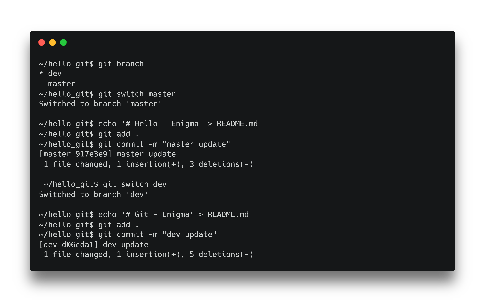
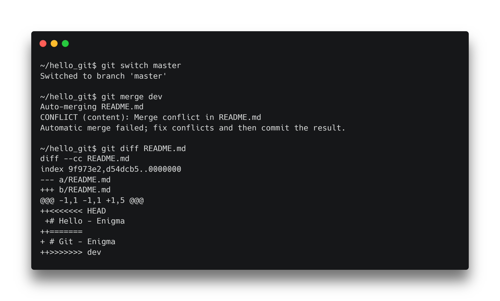
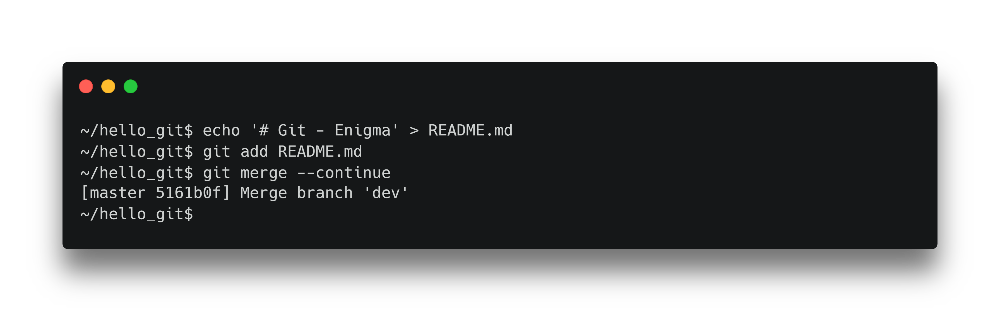

# Git

Comment réunifier nos branches ?

---


<!--
Pour rappel voici a quoi ressemble notre dépôt Git.
-->

---

# Fast-forward merge

> Changer de référence

<!--
Le merge fast-forward est le plus simple des merge, il s'agit en fait de changer la référence du commit dans la branche.

C'est une option possible si les branches n'ont pas divergé.

Par exemple dans notre cas, il ne serait pas possible d'utiliser le fast-forward si la branche master contenait un commit après le commit update README.md.
-->

---


<!--
La branche master pointe maintenant sur le même commit que dev, à savoir le dernier commit.
-->

---



<!--
Pour merger une branche, il faut se positionner sur la branche en question.

Puis faire un git merge <branch>
-->

<!--
```
git branch

git switch <branch>

git merge <branch>
```
-->

---

# 3-way merge


<!--
On utilise le merge à 3 sources quand 2 branches à merger divergent

Prenons le cas ou notre branche master et notre branche dev avancent indépendamment.

Modifions une fois de plus notre fichier README dans la branche master et ajoutons un fichier .gitignore dans la branche dev.
-->

---



<!--
Nous créons nos fichier et nous les ajoutons à Git.
-->

<!--
```
git branch
git switch master

printf "# Hello Git - Enigma\n\nMerge chapter\n" > README.md
git add README.md
git commit -m "merge chapter"

git switch dev
echo ".vscode" > .gitignore
git add .gitignore
git commit -m "add .gitignore"
```
-->

---


<!--
Ici nous avons de la chance.

Nos deux branches ne modifient pas le même fichier.

Git va donc réussir à faire un merge à trois sources de manière automatique.
-->

---



<!--
Sous Nano
CTRL+O
CTRL+X
-->

<!--
```
git switch branch master

git merge dev
```
-->

---



<!--
Nous voyons que notre merge est un succès.

Et qu'il existe bien un nouveau commit.
-->

<!--
```
git log --pretty=oneline
```
-->

---


<!--
Nous pouvons voir que nous avons créé un nouveau commit de merge.
-->

---



<!--
Modifions maintenant notre fichier README.md
-->

<!--
```
git branch
git switch master

echo '# Hello - Enigma' > README.md
git add .
git commit -m "master update"

git switch dev

echo '# Git - Enigma' > README.md
git add .
git commit -m "dev update"
```
-->

---



<!--
Faisons à nouveau un merge de la branche dev sur la branche master.

Nous pouvons voir que Git n'arrive pas à faire le merge.

Nous allons devoir lui indiquer comment faire.

<<<<<<< (gauche) est le contenu de notre branche de destination

======= est le séparateur de différence

>>>>>>> (droite) est le contenu de notre branche source

-->

<!--
```
git switch master

git merge dev

git diff README.md
```
-->

---



<!--
Nous devons modifier le fichier README.md est indiquer le contenu que nous désirons.
-->

<!--
```
echo '# Git - Enigma' > README.md
git add README.md
git merge --continue
```
-->