# Git

Quels sont les différents objets Git ?

---

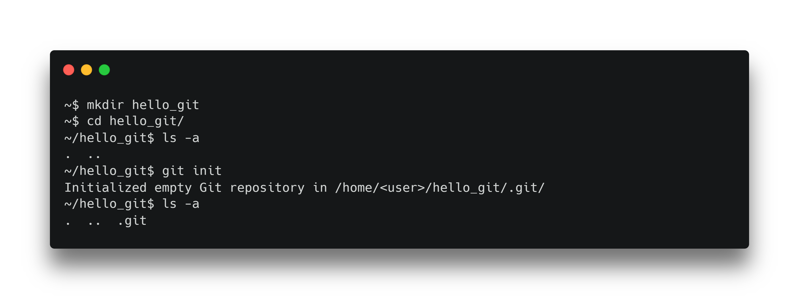

<!--
Git repose sur un système de fichiers, les objets git sont contenus dans le dossier .git/objets
-->

---

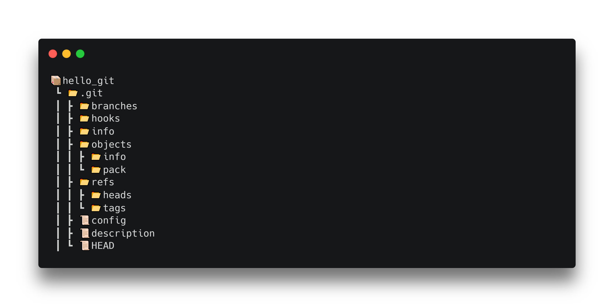

<!--
Autre vue de notre dépôt Git.
-->

---


<!--
On peut se représenter les objets git comme ceci.

Le blob représente le contenu d'un fichier, blob veut dire binary large object.

Le tree représente les fichiers et dossiers, un blob représente un fichier, un tree un dossier.

Le commit représente un tree avec plus d'informations, comme un message.

Il permet en quelques sortes de figer un ensemble de fichiers et de dossiers dans un état précis.
-->

---

# Blob

> Binary Large Object

<!--
L'objet blob représente le contenu d'un fichier. 

Pour le voir, nous allons utiliser les commandes git de bas niveau, nous verrons les hauts niveaux plus tard.
-->

---

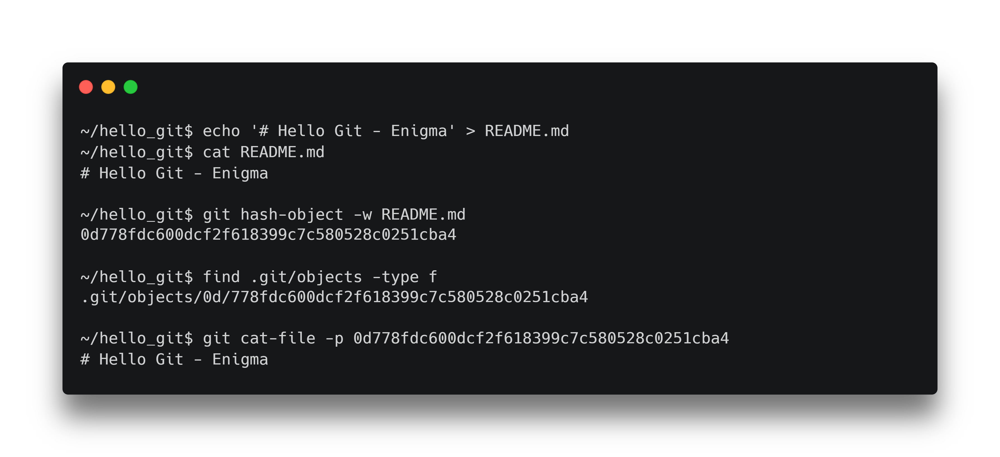

<!--
Nous pouvons voir qu'ajouter un fichier à git ajoute bien un nouveau fichier dans le dossier .git/objects.

Nous retrouvons bien notre id d'objet.

La commande hash-object permet d'ajouter un fichier au système, (-w pour write) et elle nous retourne le hash de l'objet.

Le hash est unique !

La commande cat-file permet de lire un fichier présent dans le système à partir de son hash. (-p pour formatage automatique).
-->

<!--
```
echo '# Hello Git - Enigma' > README.md
cat README.md

git hash-object -w README.md
find .git/objects -type f

git cat-file -p
```
-->

---

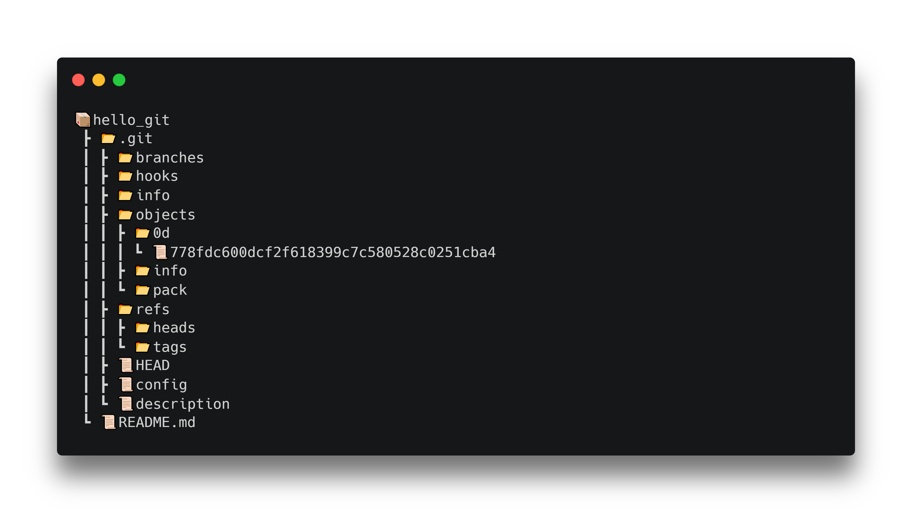

<!--
Nous voyons bien un nouveau fichier dans notre arborescence.
-->

---

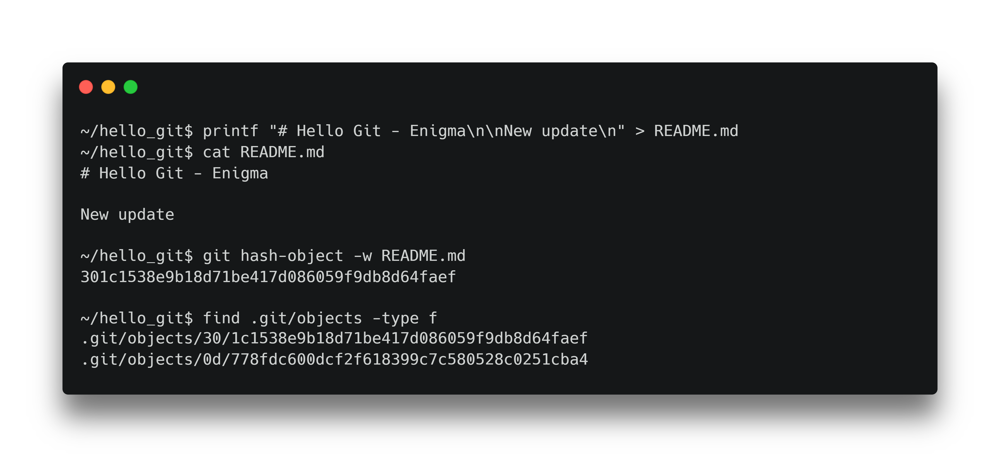

<!--
Nous pouvons voir que lorsque nous modifions un fichier, Git en créée un deuxième dans son arborescence, c'est grâce à cela que nous pouvons retrouver nos fichiers à des états différents.
-->
---

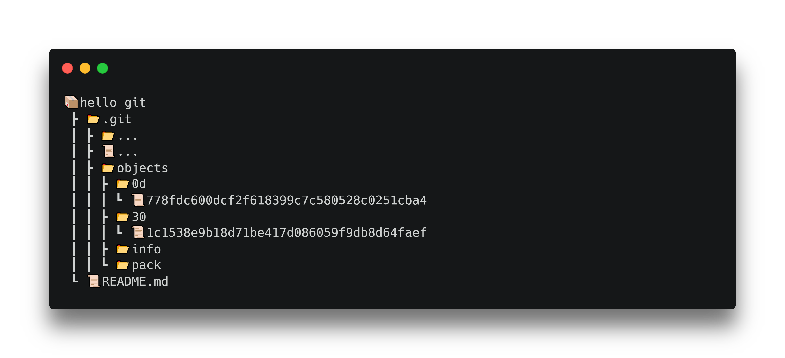

<!--
Nous voyons bien un nouveau fichier dans notre arborescence.

Nous savons comment créer des blobs, voyons maintenant comment créer des tree.
-->

---


<!--
Rappel de notre modèle.

Pour pouvoir créer des tree, nous allons avoir besoin de comprendre les différents espaces de travail de git.
-->

---

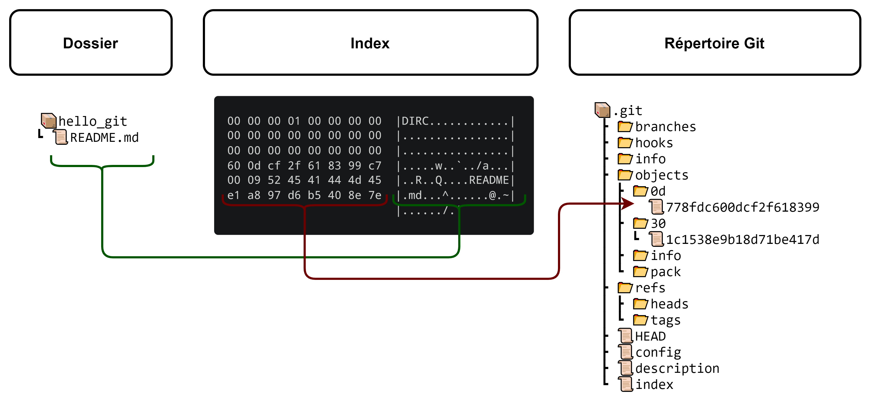

<!--
Nous avons donc notre dossier de travail qui contient nos fichiers.

Nous avons notre répertoire Git.

Et nous avons l'index qui est la zone de travail de Git.

L'index est un fichier binaire (pensez à un tableau excel) qui contient les noms de fichiers et les blobs sur lesquels nous travaillons.

Pour créer un objet tree, nous devons travailler dans l'index Git, aussi appelé stagging area.
-->

---

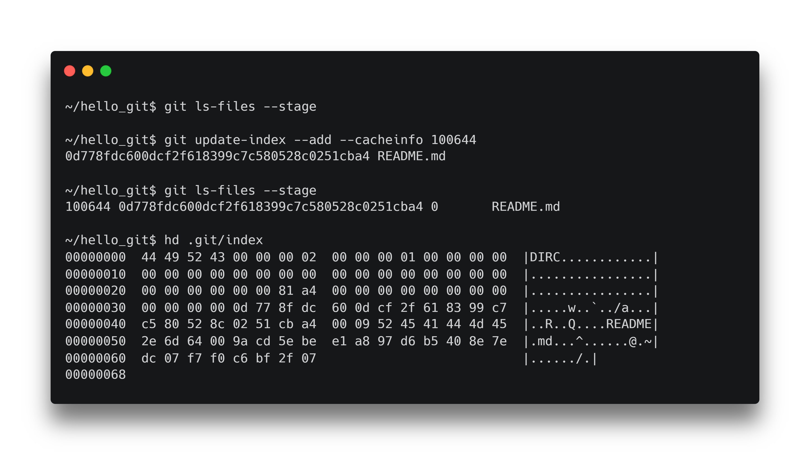

<!--
Commençons par ajouter notre première version du fichier README.md dans la zone de travail de Git.

Nous fournissons le hash du blob concerné, le mode du fichier, ici 100644 pour un fichier normal (100755 pour un exécutable, 120000 pour un lien symbolique)..

Nous pouvons ensuite voir que nous avons un fichier dans la zone de travail Git.
-->

<!--
```
git ls-files --stage
git update-index --add --cacheinfo 100644 <hash>
hd .git/index
git rm --cached <file>
```
-->

---

# Tree

> Association blob, nom, meta 

---

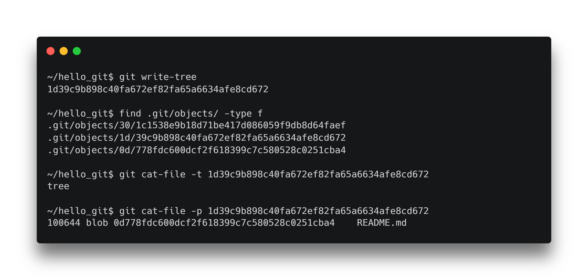

<!--
Nous pouvons maintenant créé notre tree à partir de l'index Git.

Au même titre que le blob, le tree possède un hash et est stocké dans un fichier.
-->

<!--
```
git write-tree
find .git/objects/ -type f
git cat-file -t <hash>
git cat-file -p <hash>
```
-->

---

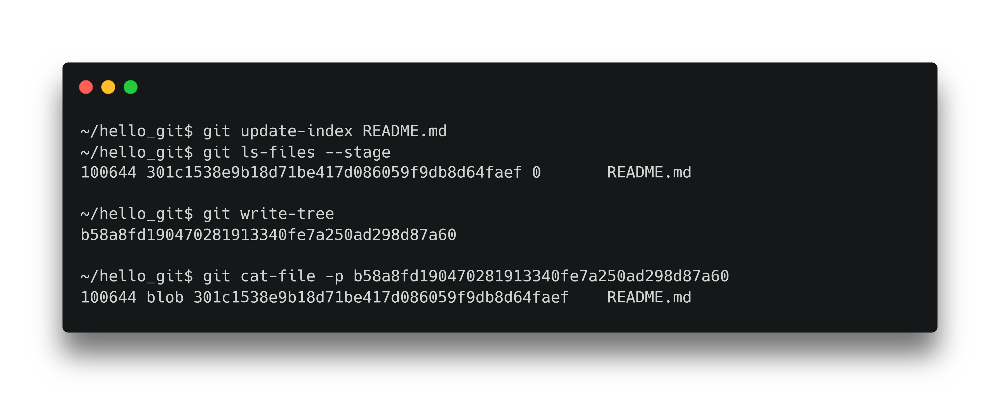

<!--
Si nous mettons à jour l'index avec notre nouvelle version de fichier (la dernière).

Nous voyons que le hash du blob n'est plus le même dans l'index Git.

Il en va de même pour le tree.
-->

<!--
```
git update-index README.md
git ls-files --stage
git writre-tree
git cat-file -p <hash>
```
-->

---


<!--
Rappel de notre modèle.

Nous venons de créer deux tree, nous venons de créer deux versions différentes de notre fichier README.md

Voyons comment créer un commit et donner du sens à nos tree.
-->

---

# Commit

> Association tree, auteur, message

---

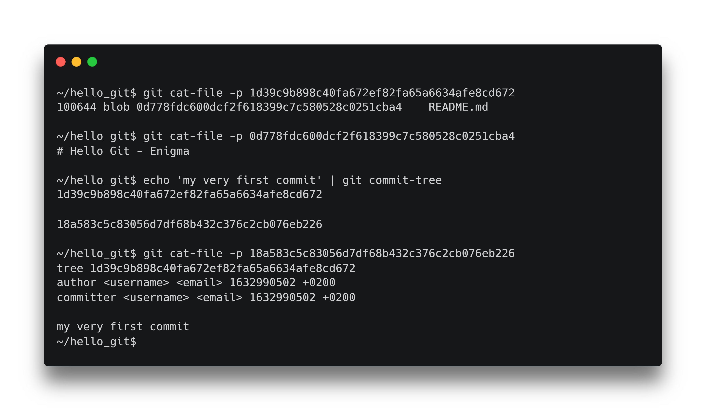

<!--
Nous pouvons créer un commit à l'aide de la commande interne commit-tree, nous fournissons un message et le hash du tree.

Nous pouvons voir notre commit qui contient bien notre message et notre commit.
-->

<!--
```
find .git/objects -type f
git cat-file -p
git cat-file -p
echo 'message' | git commit-tree
```
-->

---

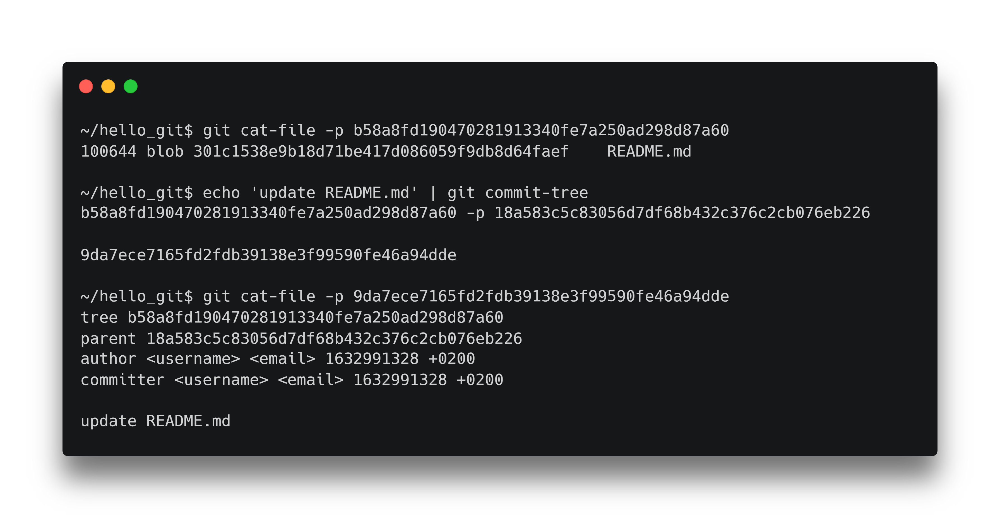

<!--
Créons maintenant notre second commit qui représente la mise à jour de notre fichier README.md et fournissons lui notre premier commit comme parent.

En ouvrant le commit, nous voyons bien que notre précédent commit est bien le parent de celui-ci (my very first commit).

Nous venons de créer une chaîne de commit !

Voyons comment faire des chaînes plus complexes à l'aide des branches.
-->

<!--
```
ehco 'update' | git commit-tree <hash> -p <parent_hash>
```
-->

---


---


<!--
Il existe un autre objet git qui nous permet de faire des graphes de commit.

C'est la branche.

La branche est définie par un nom et par un commit.
-->

---

# Branche

> Pointeur d'un commit

---

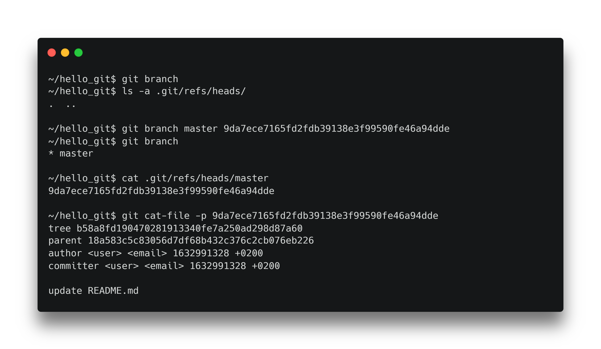

<!--
Nous pouvons créer une branche à l'aide de la commande git branch <name> <commit>

Nous pouvons voir que c'est un fichier contenant le hash de notre commit.
-->

<!--
```
git branch
ls -a ./git/refs/heads/

git branch master <commit>
git branch

cat ./git/refs/heads/master

git cat-file -p
```
-->

---


<!--
Nous avons créé la branche master qui pointe sur le dernier commit connu.
-->

---

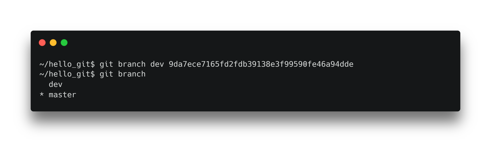

<!--
Si nous le souhaitons, nous pouvons créer une deuxième branche qui pointe sur le même commit.

Nous voyons aussi que nous travaillons actuellement sur la branche master.
-->

<!--
```
git branch dev <commit>
git branch
```
-->

---


<!--
Nous voyons nos branches qui pointent sur le même commit.


Se pose la question de comment fait git pour savoir sur quelle branche travailler ?

Cela est réalisé avec un autre fichier, le fichier HEAD qui pointe sur une branche
-->

---

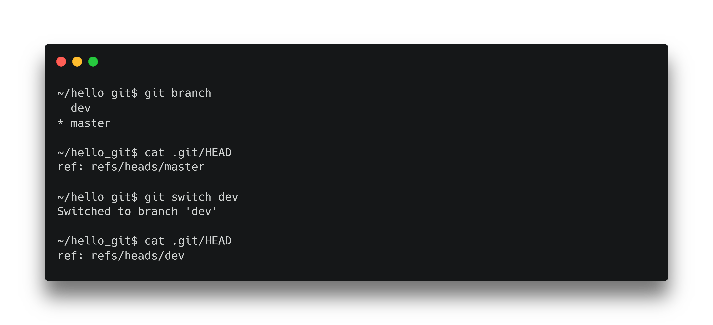

<!--
Pour nous en convaincre, nous pouvons changer de branche à l'aide de la commande switch et voir ce qu'il se passe.

Nous voyons bien que notre HEAD a été modifié.

Modifions notre fichier et ajoutons un nouveau commit à la branche dev.
-->

<!--
```
git branch
cat .git/HEAD
git switch dev
cat .git/HEAD
```
-->

---

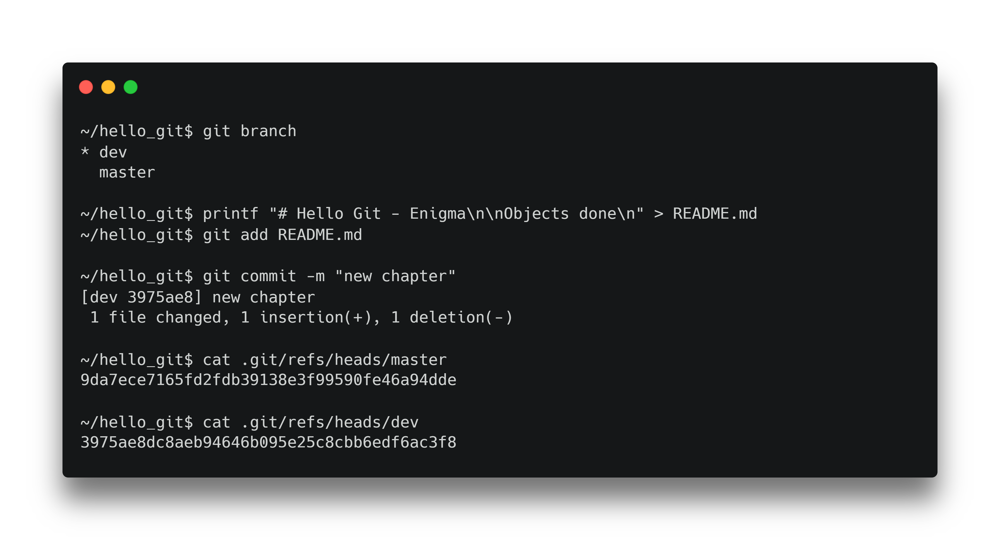

<!--
A partir de maintenant, nous allons voir les commandes haut niveau de git.

git has-object et git update-index vont être remplacés par git add.

git commit-tree va être remplacé par git commit.

Nous pouvons voir que la branche master et la branche commit ne pointent plus sur le même commit.
-->

<!--
```
git branch
printf "# Hello Git - Enigma\n\nObjects done\n" > README.md
git add README.md
git commit -m "new chapter"
cat .git/refs/heads/master
cat .git/refs/heads/dev
```
-->

---


<!--
Une autre représentation.

Il nous reste un dernier objet Git à voir, les tags.
-->

---

# Tag

> Pointeur figé d'un commit

<!--
Les tags sont semblables aux branches à ceci près qu'ils ne sont pas modifiables, ils sont figés.
-->

---


---

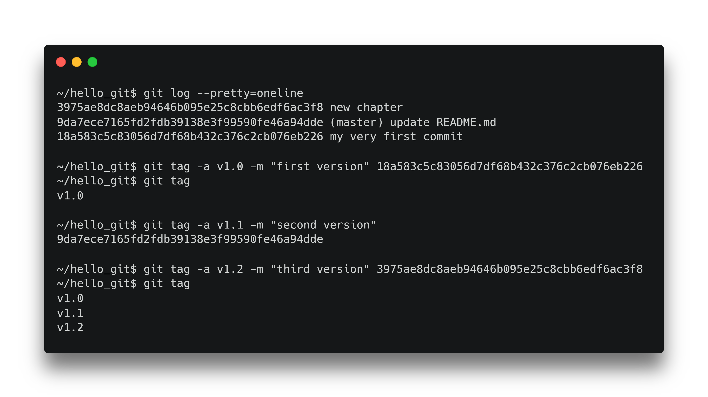

<!--
Créons un tag pour chacune des versions de notre fichier README.md
-->

<!--
```
git log --pretty=oneline

git tag -a v1.0 -m "first version" <commit>
git tag -a v1.1 -m "second version" <commit>
git tag -a v1.2 -m "third version" <commit>
```
-->

---

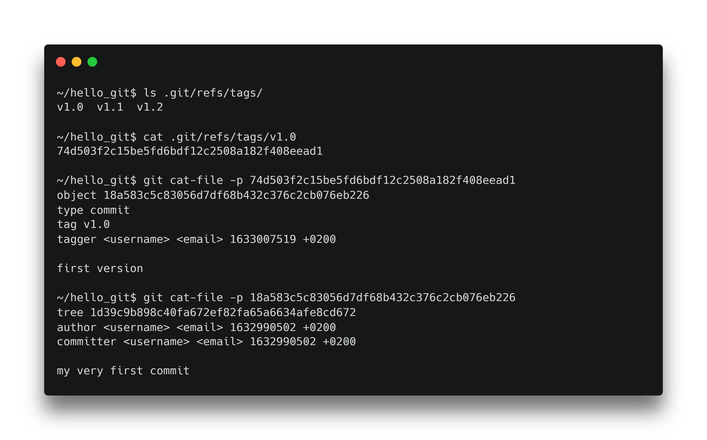

<!--
Pour s'en convaincre, nous pouvons ouvrir notre tag et retrouver notre tout premier commit.

Nous avons vu comment travailler sur notre poste, voyons comment travailler un dépôt distant.
-->

<!--
```
ls .git/refs/tags/
cat .git/refs/tags/v1.0

git cat-file -p <hash>
```
-->
