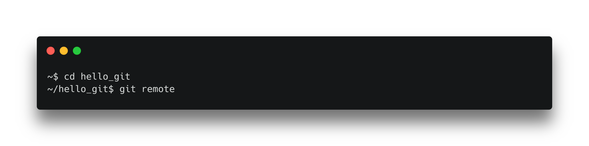
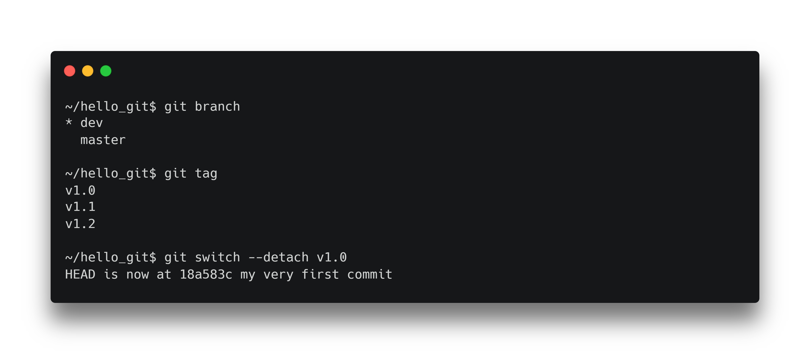

# Git

Comment gérer les dépôts et la synchronisation ?

---

# Dépôt distant


> Créer un dépôt vide sur [GitHub](https://github.com/)

---


<!--
Pour pouvoir utiliser Github agréablement, nous avons besoin de sécuriser nos échanges avec une clé SSH.
-->

<!--
```
ls ~/.ssh

ssh-keygen -t ed5519 -C "email"
```
-->

---


<!--
Nous ajoutons ensuite notre nouvelle clé à l'agent SSH.
-->

<!--
```
eval "$(ssh-agent -s)"
ssh-add ~/.ssh/id_ed25519
cat ~/.ssh/id_ed25519.pub
```
-->

---


<!--
Nous l'ajoutons à GitHub dans la partie préférences puis SSH and GPG keys.
-->

---



<!--
Nous pouvons voir que nous n'avons pas de dépôts distants connus.
-->

<!--
```
git remote
```
-->

---


<!--
Faisons maintenant le lien entre notre dépôt local et notre dépôt GitHub à l'aide la commande : git remote add <origin> <url_git>

Nous pouvons maintenant publier nos premiers commits sur GitHub.
-->

<!--
```
git remote add origin git@github.com:averdier/hello_git.git
```
-->

---


<!--
Nous pouvons publier nos premiers commits sur Githb à l'aide de la commande git push <depot_distant> <branch>
-->

<!--
```
git push origin dev
```
-->

---


<!--
De la même manière nous pouvons publier un tag.
-->

<!--
```
git push origin v1.0
```
-->

---


<!--
Faisons une modification de notre fichier README.md depuis l'interface de GitHub.

Récupérons maintenant la mise à jours depuis GitHub.

```
git pull origin dev
```
-->

---



<!--
Nous pouvons changer de branche pour retrouver le contenu associé au tag.

Nous utilisons l'option detach car nous ne pouvons pas faire de modification d'un tag.
-->

<!--
```
git switch --detach v1.0
```
-->
---


<!--
Nous retrouvons bien notre fichier.

Et git nous indique que nous sommes sur une branche détachée.
-->

<!--
```
cat README.md
git branch
```
-->

---

# Exercice

<!--
Créez une nouvelle branche.

Modifiez le fichier README.md

Faites un nouveau commit

Publiez la branche master.

Publiez tout les tags.

Publiez la nouvelle branche sur Github.

M'envoyer le lien.
-->
