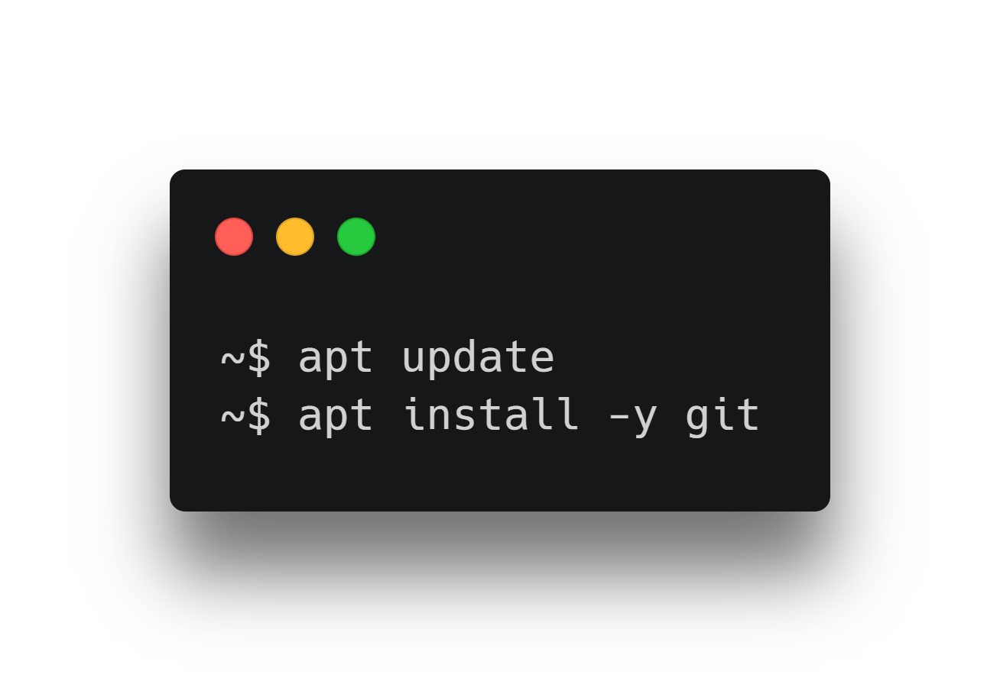
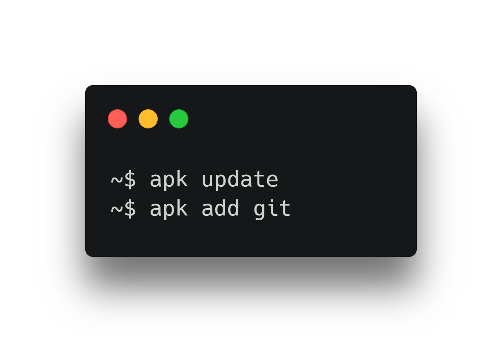
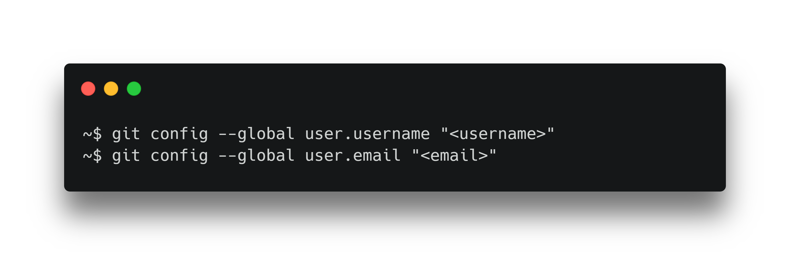
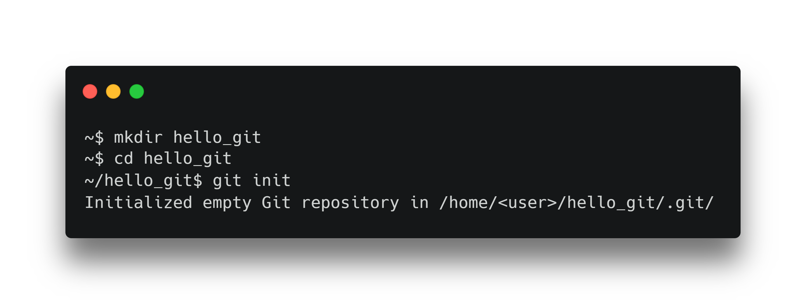

# Git

Comment mettre en place et configurer Git ?

---

# Installation

---



## Linux

> Pour Débian et dérivés

<!--
Il suffit de taper les commandes suivantes dans un terminal.
-->

<!--
```
apt update
apt install -y git
```
-->

---

## Windows

[Git for Windows](https://gitforwindows.org/)

<!--
Permet une installation simple de Git avec des interfaces graphiques.

L'ensemble des commandes seront à faire dans Git Bash.
-->

---

## Mac

[Git SCM](https://git-scm.com/download/mac)

---



# iOS

[iSH](https://ish.app/)

<!--
Il suffit de taper les commandes suivantes dans un terminal.
-->

<!--
```
apk update
apk add git
```
-->

---

# Configuration

---



<!--
Commençons par définir notre identité dans la configuration de Git.
-->

---



<!--
Créons notre premier dépôt Git.
-->

<!--
```
mkdir hello_git
cd hello_git
git init
```
-->